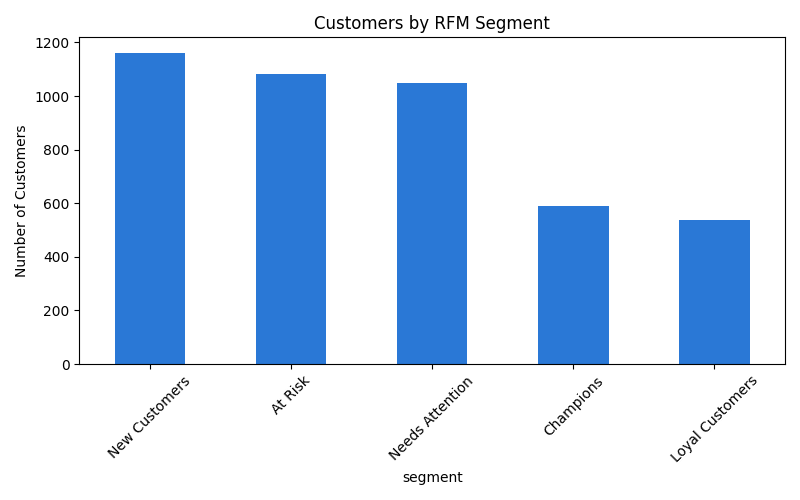

# ga4-ecommerce-funnel-analysis
SQL/BigQuery and Python analysis of 400K+ GA4 e-commerce events: purchase funnel, channel-conversion breakdown, and customer segmentation on Google's public Merchandise Store dataset.

## Part 1: Funnel & Channel Analysis (BigQuery, SQL)
- The steepest funnel drop-off is at checkout, not the top: 77.4% of cart-adders begin checkout, but only 45.5% of those complete a purchase.
- Only 1 in 5 users who view a product ever add it to cart, the single largest-volume opportunity in the funnel.
- Google drives the most traffic (127K sessions) but converts at just 1.28%, the lowest of any major channel; direct traffic converts 19% higher despite fewer sessions.
- Excluded "(data deleted)" and the store-referral bucket from channel recommendations since neither represents an actionable marketing channel.

Dashboard: https://datastudio.google.com/s/hZlttfHCDHo

## Part 2: Customer Segmentation (RFM, Python/Pandas)
Extended the funnel analysis by segmenting the same purchasers using RFM (Recency, Frequency, Monetary).
- Champions (589 customers) average $156.27 per person, the highest of any segment, validating the model.
- At Risk customers (1,084 people who've gone quiet) still average $107.52, nearly double New Customers ($59.85), making them a higher-ROI re-engagement target than typically prioritized segments.
- Note: the Loyal Customers segment shows a low average ($22.39) by construction, high-spenders in that recency/frequency bucket route to Champions instead, not a signal that loyal customers are low-value.

## Tools
BigQuery (SQL), Python (Pandas), Data Studio

## Files
- `queries.sql` — SQL used for the funnel and channel analysis
- `RFM segments.ipynb` — Python/Pandas notebook for the RFM segmentation
- `rfm_segments.png` — chart output from the notebook
